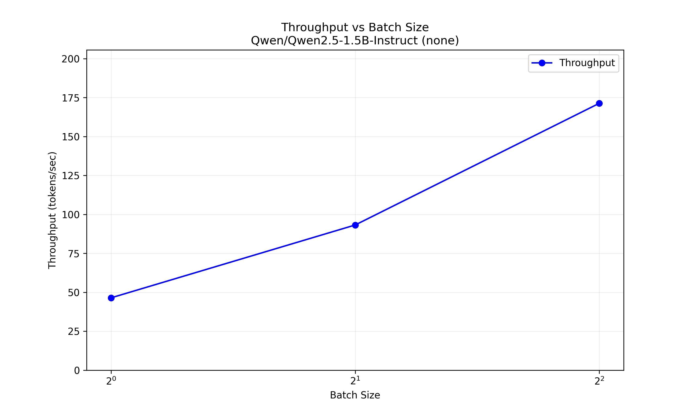
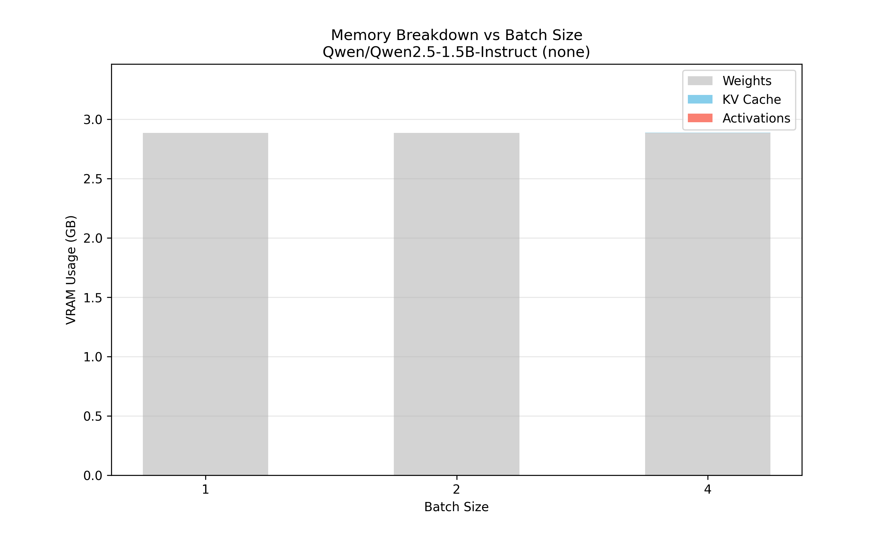

# LLM Inference Profiler

A professional command-line tool that automatically benchmarks and profiles the inference performance of any HuggingFace language model.

## Features

- **Automated Profiling**: Measures memory usage, throughput, latency, and OOM limits.
- **Batch Size Sweep**: Automatically finds the maximum batch size before OOM.
- **Prefill vs Decode**: Measures input processing speed vs generation speed.
- **Memory & Latency Breakdown**: Analyzes VRAM usage and generation latency vs output length.
- **Quantization Support**: Easy testing of 4-bit, 8-bit, fp16, and bf16 precision.
- **JSON & Visualization**: Generates structured JSON reports and visualization plots (throughput/memory).
- **HTML/Markdown Reports**: Creates rich, shareable reports.
- **Model Comparison**: Compare performance of multiple models side-by-side.
- **Robustness**: Auto-detects CPU/CUDA, manages disk space/cache, and handles errors gracefully.

## Installation

```bash
pip install llm-profiler
```

Or for development:

```bash
git clone https://github.com/rohitkt10/llm-profiler.git
cd llm-profiler
pip install -e .
```

## Usage

### Basic Profiling

Profile a model with default settings. Here is a real run on `Qwen/Qwen2.5-0.5B-Instruct`:

```bash
llm-profile --model "Qwen/Qwen2.5-0.5B-Instruct" --max-batch-size 4 --max-new-tokens 20
```

**Actual Output:**
```
🔍 Profiling Qwen/Qwen2.5-0.5B-Instruct...
  Configuration: quant=none, device=auto, max_bs=4
[1/5] Loading model...
✓ Model loaded: 0.9 GB VRAM
[2/5] Testing batch sizes (up to 4)...
  BS=1: ✓ 68.7 tok/s (0.3s)
  BS=2: ✓ 128.9 tok/s (0.3s)
  BS=4: ✓ 247.4 tok/s (0.3s)
✓ Max successful batch size: 4
[3/5] Measuring prefill vs decode...
  Prefill (100 tokens): 0.01s
  Decode (20 tokens):   0.30s
  Ratio: 20.3x slower
[4/5] Memory and latency profiling...
  Model weights: 0.94 GB
  KV cache (BS=1, 100 tokens): 0.00 GB
  Activation memory: 0.01 GB
  Total: 0.94 GB
  Output length impact:
    10 tokens: 0.16s
    25 tokens: 0.39s
    50 tokens: 0.76s
    100 tokens: 1.55s
    200 tokens: 3.20s
[5/5] Generating report...
✓ Results saved to: ~/.llm_profiler/profiles/Qwen-Qwen2.5-0.5B-Instruct-none-20251217-104715.json
✓ Plot saved to: ~/.llm_profiler/plots/Qwen-Qwen2.5-0.5B-Instruct-none-throughput.png
✓ Plot saved to: ~/.llm_profiler/plots/Qwen-Qwen2.5-0.5B-Instruct-none-memory.png
```

### Report Generation

Generate HTML or Markdown reports (plots are automatically embedded/linked):

```bash
llm-profile --model "Qwen/Qwen2.5-0.5B-Instruct" --output html
```

### Model Comparison

Compare multiple models sequentially (results aggregated):

```bash
llm-profile --compare "Qwen/Qwen2.5-0.5B-Instruct,Qwen/Qwen2.5-1.5B-Instruct" --quantization 4bit --max-batch-size 4 --max-new-tokens 20
```

**Actual Output:**
```
🔍 Starting comparison for 2 models: Qwen/Qwen2.5-0.5B-Instruct, Qwen/Qwen2.5-1.5B-Instruct

--- Profiling Qwen/Qwen2.5-0.5B-Instruct ---
🔍 Profiling Qwen/Qwen2.5-0.5B-Instruct...
  Configuration: quant=4bit, device=auto, max_bs=4
[1/5] Loading model...
✓ Model loaded: 0.4 GB VRAM
...
[5/5] Generating report...
✓ Results saved to: ~/.llm_profiler/profiles/Qwen-Qwen2.5-0.5B-Instruct-4bit-20251217-105941.json

--- Profiling Qwen/Qwen2.5-1.5B-Instruct ---
🔍 Profiling Qwen/Qwen2.5-1.5B-Instruct...
  Configuration: quant=4bit, device=auto, max_bs=4
[1/5] Loading model...
✓ Model loaded: 1.1 GB VRAM
...
[5/5] Generating report...
✓ Results saved to: ~/.llm_profiler/profiles/Qwen-Qwen2.5-1.5B-Instruct-4bit-20251217-110002.json


🔍 Generating Comparison Report...
✓ Comparison JSON saved to: ~/.llm_profiler/profiles/comparison-20251217-110003.json
✓ Comparison plot saved to: ~/.llm_profiler/plots/comparison-20251217-110003-throughput.png
```

### HTML Report Example

A full HTML report generated for `Qwen/Qwen2.5-1.5B-Instruct` provides a comprehensive overview. Below are the actual plots and metrics from a run:

#### Visualizations

**Throughput vs Batch Size**



**Memory Breakdown**



#### Metrics Summary

**System Info**

| Metric | Value |
| :--- | :--- |
| Cuda Version | 12.8 |
| Pytorch Version | 2.9.1+cu128 |
| Gpu Name | NVIDIA GeForce RTX 5060 Laptop GPU |
| Total Vram Gb | 7.96 |
| System Ram Gb | 15.18 |

**Throughput**

| Batch Size | Tokens/sec | Time (sec) |
| :--- | :--- | :--- |
| 1 | 45.0 | 0.40 |
| 2 | 91.1 | 0.40 |
| 4 | 167.7 | 0.50 |

**Memory Breakdown**

| Component | Size |
| :--- | :--- |
| Weights | 2.88 GB |
| Kv Cache | 0.00 GB |
| Activations | 0.01 GB |
| Total | 2.89 GB |

**Prefill vs Decode**

| Metric | Value |
| :--- | :--- |
| Prefill Time | 0.02 s |
| Decode Time | 0.46 s |
| Ratio | 18.4x slower |
| Per Token Decode | 23.00 ms |

**Output Length Impact**

| Tokens | Total Time |
| :--- | :--- |
| 10 | 0.24 s |
| 25 | 0.59 s |
| 50 | 1.18 s |
| 100 | 2.38 s |
| 200 | 4.77 s |

**Batch Size Impact (Latency)**

| Batch Size | Time/Token |
| :--- | :--- |
| 1 | 22.22 ms |
| 2 | 10.98 ms |
| 4 | 5.96 ms |

### Quantization Testing

Test with 4-bit quantization to observe memory savings and throughput impact:

```bash
llm-profile --model "Qwen/Qwen2.5-0.5B-Instruct" --quantization 4bit --max-batch-size 4 --max-new-tokens 20
```

### Custom Limits

Limit the batch size sweep and generation length:

```bash
llm-profile --model "Qwen/Qwen2.5-0.5B-Instruct" --max-batch-size 16 --max-new-tokens 100
```

## License

MIT